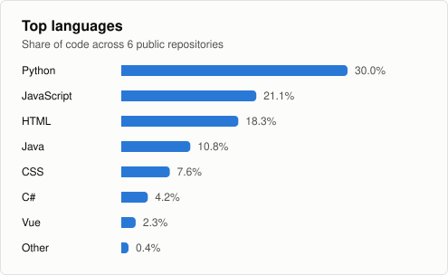

# 👋 Hello, I'm BretzelCoder!

### 👨‍💻 VP of Engineering & Software Craftsmanship Lover
> "Still shipping code — because architecture decisions age badly when you stop."

I lead engineering teams, and I keep writing code, exploring new architectures and hacking on side projects. Staying hands-on is what keeps my technical judgement honest. This profile is my digital playground.

---

### 🧭 What I do

*   **Scope:** Leading up to 95 engineers (Managers, Architects, Devs, QA) on 6 different Supply Chain Solutions at QAD
*   **Focus:** Merging technological excellence with a pragmatic business vision to transform innovation into a sustainable competitive advantage for our customers (in line with end users’ expectations) and for the efficiency and well-being of our teams.
*   **Recent wins:** Transform legacy Supply Chain Planning Solution (DSCP) from On Premise to real SaaS

---

### 🚀 Featured Projects

Here are some of my public experiments and labs that I like to maintain:

*   **[ZeTimeConnect](https://github.com/BretzelCoder/ZeTimeConnect)** - A basic script and GUI to reconnect and interact with the MyKronoz ZeTime hybrid watch. (Python)
*   **[GoogleAgendaAssistant](https://github.com/BretzelCoder/GoogleAgendaAssistant)** - Import `.ics` files and iCalendar feeds into Google Calendar: a serverless browser app, plus a Flask variant that also syncs a SIGA university timetable. (Python, JavaScript)
*   **[Fibonacci](https://github.com/BretzelCoder/Fibonacci)** - Caching strategies and algorithmic optimization compared across three stacks: Python (Flet GUI, pytest), a .NET 9 API with a Vue 3 front end, and Java 21 with Spring Boot. (Python, C#, Vue, Java)
*   **[FruitSudoku](https://github.com/BretzelCoder/FruitSudoku)** - A fun Sudoku game using fruits and vegetables instead of numbers. (JavaScript)
*   **[PublicDatasetAndStatistics](https://github.com/BretzelCoder/PublicDatasetAndStatistics)** - Investigations into statistics on French Government public data, such as elections. (HTML, JavaScript, Python)
*   **[reachouttrack-landing](https://github.com/BretzelCoder/reachouttrack-landing)** - Static landing page for ReachOutTrack, served from GitHub Pages at www.reachouttrack.org. (HTML)

---

<!-- The language card is generated by .github/workflows/language-card.yml (weekly PR).
     It replaces the public github-readme-stats card, which is broken: it first returned
     DEPLOYMENT_PAUSED (503) and, as of 2026-10-06, answers 200 with an error image. -->

  

### 🛠️ Tech Stack & Ecosystem

*   **Languages:** C++, C#, .NET, Python, TypeScript, JavaScript (ES6+), Vue 3
*   **Concepts:** API Integration, Software Architecture, Automation, Performance Caching, Agility
*   **Workflows:** Git, Pull Request Reviews, Continuous Collaboration, AI-assisted development
*   **Methodology:** Moving from Waterfall to Agile (Scrum/Kanban) for Engineering and Hybrid Agile for Implementations
*   **Cloud:** Private to Public Cloud (AWS, GCP)

---

### 🌐 Connect with me

*   **💼 LinkedIn :** [Jean-Luc Rominger](https://www.linkedin.com/in/jean-lucrominger/)

---

  

